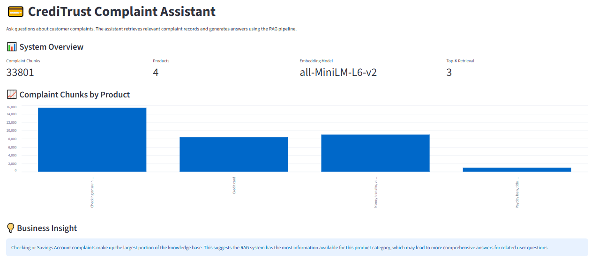
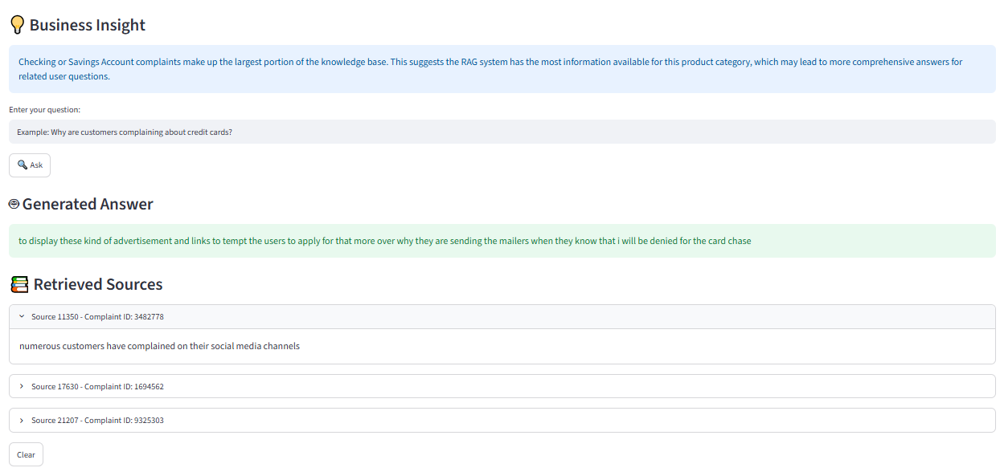

# CrediTrust Complaint Assistant - RAG System

[](https://github.com/hawaebrahimhamid/rag-complaint-chatbot/actions/workflows/tests.yml)


A Retrieval-Augmented Generation (RAG) chatbot that helps users analyze customer complaints from the CFPB dataset. The system retrieves relevant complaint records using semantic search and generates answers using a language model.


## Business Problem

Financial institutions receive thousands of customer complaints across different products and services. Manually reviewing these complaints is time-consuming and makes it difficult to identify common customer issues.

Customer support teams need a solution that can quickly search complaint information, identify recurring problems, and provide reliable answers based on historical customer experiences.

This project addresses this challenge by building an AI-powered complaint assistant that uses Retrieval-Augmented Generation (RAG) to retrieve relevant complaint information and generate evidence-based responses.


## Solution Overview

This project implements a Retrieval-Augmented Generation (RAG) pipeline that combines semantic search with a language model.

The solution workflow:

1. Clean and preprocess CFPB complaint data.
2. Split complaint narratives into smaller semantic chunks.
3. Generate embeddings using Sentence Transformers.
4. Store embeddings in a FAISS vector database.
5. Retrieve relevant complaint chunks using similarity search.
6. Generate answers using the FLAN-T5 language model.
7. Provide an interactive Streamlit interface with retrieved sources.


## Key Results

The project achieved the following technical outcomes:

- Processed CFPB customer complaint data and prepared it for semantic retrieval.
- Created a searchable FAISS vector database containing complaint chunks.
- Implemented semantic retrieval using `sentence-transformers/all-MiniLM-L6-v2`.
- Built a RAG pipeline using `google/flan-t5-small`.
- Developed an interactive Streamlit dashboard for complaint analysis.
- Added automated testing with 7 passing pytest tests.
- Implemented CI/CD validation using GitHub Actions.


## Tech Stack

- **Programming Language:** Python
- **Web Framework:** Streamlit
- **Embedding Model:** sentence-transformers/all-MiniLM-L6-v2
- **Language Model:** google/flan-t5-small
- **Vector Database:** FAISS
- **Libraries:** Hugging Face Transformers, Pandas, Scikit-learn


## Quick Start

```bash
git clone https://github.com/hawaebrahimhamid/rag-complaint-chatbot.git
cd rag-complaint-chatbot
pip install -r requirements.txt
streamlit run app.py
```


---


## Project Structure

```text
rag-complaint-chatbot/

├── app.py
├── src/
│   └── rag/
│       ├── retriever.py
│       ├── generator.py
│       ├── pipeline.py
│       └── prompt.py
│
├── tests/
├── data/
├── vector_store/
├── reports/
│   └── images/
├── requirements.txt
└── README.md
```

## Demo

The Streamlit dashboard enables users to:

- Ask questions about customer complaints.
- Retrieve semantically similar complaint records.
- Generate AI-powered responses.
- View the complaint source chunks used to generate each answer.

Example screenshots are available in the **Task 4** section below.

## System Architecture

The application follows a Retrieval-Augmented Generation pipeline:

```text
User Question
      │
      ▼
Query Embedding
      │
      ▼
FAISS Similarity Search
      │
      ▼
Relevant Complaint Chunks
      │
      ▼
Prompt Construction
      │
      ▼
FLAN-T5 Generator
      │
      ▼
Final Answer + Sources
```

## Technical Details

### Data

Source:
CFPB Consumer Complaint Dataset

Preprocessing:
- Filtered financial complaint categories.
- Removed missing narratives.
- Cleaned complaint text.
- Created semantic chunks.

### Model

Embedding Model:
`sentence-transformers/all-MiniLM-L6-v2`

Vector Database:
FAISS

Generation Model:
`google/flan-t5-small`

### Evaluation

The system was evaluated based on:

- Retrieval relevance
- Answer quality
- Source transparency
- Automated unit testing


## Task 1: Exploratory Data Analysis and Data Preprocessing

## Objective

The objective of this task was to explore the CFPB Consumer Complaint Dataset, evaluate its quality and structure, and prepare a clean dataset for use in a Retrieval-Augmented Generation (RAG) system.

## Dataset Overview

The CFPB Consumer Complaint Dataset contains consumer-submitted complaints across a wide range of financial products and services. An initial exploratory data analysis (EDA) was conducted to understand the dataset, identify data quality issues, and determine the preprocessing steps required before semantic retrieval and embedding generation.

## Exploratory Data Analysis

The following analyses were performed:

- Examined the dataset dimensions and available features.
- Analyzed the distribution of complaints across financial product categories.
- Counted records with and without consumer complaint narratives.
- Calculated complaint narrative lengths using word counts.
- Visualized the distribution of narrative lengths to identify unusually short or long complaints.

### Key Findings

The exploratory analysis revealed several important characteristics of the dataset:

- **Checking or Savings Account** complaints represented the largest proportion of the selected complaint categories.
- **Credit Card** complaints formed the second-largest group.
- **Money Transfer, Virtual Currency, or Money Service** complaints also accounted for a substantial portion of the dataset.
- **Payday Loan, Title Loan, Personal Loan, or Advance Loan** complaints were the least frequent among the selected products.
- Consumer complaint narratives varied considerably in length, ranging from brief descriptions to detailed reports exceeding 6,000 words.

These findings informed the preprocessing strategy used to prepare the data for the RAG pipeline.

---

## Data Preprocessing

To prepare the dataset for semantic search and embedding generation, the following preprocessing steps were performed:

1. Filtered the dataset to retain only the required financial product categories:
   - Credit Card
   - Checking or Savings Account
   - Money Transfer, Virtual Currency, or Money Service
   - Payday Loan, Title Loan, Personal Loan, or Advance Loan

2. Removed records with missing or empty consumer complaint narratives.

3. Cleaned the complaint narratives by:
   - Converting all text to lowercase.
   - Removing common boilerplate phrases.
   - Removing special characters and unnecessary punctuation.
   - Normalizing whitespace.

4. Created a new **`clean_text`** column containing the processed complaint narratives for downstream embedding generation.

---

## Data Validation

After preprocessing, several validation checks were performed to ensure the dataset was suitable for the RAG pipeline.

The validation confirmed that:

- All remaining records contained valid consumer complaint narratives.
- The **`clean_text`** column contained no missing values.
- Only the required financial product categories were retained.
- The cleaned narratives preserved meaningful complaint information while removing unnecessary noise.

The resulting dataset is ready for the subsequent stages of the project, including:

- Text chunking
- Embedding generation
- Vector store creation
- Semantic retrieval

---

## Output

The cleaned and preprocessed dataset was saved as:

```text
data/filtered_complaints.csv
```

This dataset serves as the primary input for the chunking, embedding, vector indexing, and retrieval components implemented in later tasks.

---

## Project Files

```text
notebooks/task1_eda.ipynb
data/filtered_complaints.csv
```
## Task 2: Text Chunking, Embedding, and Vector Store Creation

## Objective

The objective of this task was to transform the cleaned complaint narratives into semantic vector representations that enable efficient similarity search within a Retrieval-Augmented Generation (RAG) system.

The pipeline converts complaint text into embeddings and stores them in a FAISS vector database, allowing the retriever to efficiently locate the most relevant complaint excerpts for user queries.

---

## Pipeline Overview

The Task 2 pipeline consists of the following stages:

1. Data sampling
2. Text chunking
3. Embedding generation
4. Vector store indexing

The resulting vector database serves as the knowledge base for the retrieval component implemented in Task 3.

---

## Sampling Strategy

The cleaned complaint dataset contained approximately **80,667** records.

To accommodate local hardware and memory limitations during development, a smaller subset of the dataset was used for embedding generation and vector indexing.

The sampling process consisted of:

- Loading **10,000** complaint records from the cleaned dataset.
- Selecting a development sample of **1,000** complaint records for experimentation and testing.
- Preserving the original dataset so the pipeline can be scaled to the complete dataset when additional computational resources are available.

The sampled complaints were used throughout the remaining stages of the pipeline, including chunking, embedding generation, and FAISS indexing.

---

## Text Chunking

Long complaint narratives were divided into smaller text chunks before embedding generation.

Chunking improves semantic retrieval by:

- Preserving important contextual information.
- Reducing information loss in long documents.
- Producing more accurate similarity search results.
- Enabling the retriever to locate the most relevant portions of a complaint instead of an entire document.

Each generated chunk maintains a reference to its original complaint through metadata stored alongside the embeddings.

---

## Embedding Model

The project uses the following embedding model:

- **Model:** `sentence-transformers/all-MiniLM-L6-v2`
- **Embedding Dimension:** 384

This model was selected because it:

- Produces high-quality semantic sentence embeddings.
- Is computationally efficient.
- Has a relatively small model size suitable for local development.
- Is widely used in Retrieval-Augmented Generation (RAG) applications.

The generated embeddings capture the semantic meaning of complaint narratives, enabling similarity-based retrieval rather than simple keyword matching.

---

## Vector Store

FAISS (Facebook AI Similarity Search) was selected as the vector database for storing and searching complaint embeddings.

FAISS provides:

- Fast similarity search over high-dimensional vectors.
- Efficient indexing for large document collections.
- Low memory overhead.
- Excellent performance for semantic retrieval tasks.

Each stored embedding includes metadata that links the text chunk back to its original complaint record, allowing retrieved results to be traced to their source.

Generated artifacts include:

```text
vector_store/
├── faiss.index
├── metadata.csv
└── chunks.csv
```

---

## Task 2 Pipeline

```text
Filtered Complaint Dataset
        │
        ▼
Data Sampling
        │
        ▼
Text Chunking
        │
        ▼
Sentence Transformer Embeddings
        │
        ▼
FAISS Vector Index
        │
        ▼
Semantic Search Retrieval
```

---

## Output

Task 2 successfully produced a searchable semantic vector database that supports efficient retrieval of complaint information.

The generated FAISS index and associated metadata form the foundation of the Retrieval-Augmented Generation (RAG) pipeline implemented in Task 3.

---

## Project Files

```text
src/
├── chunking.py
├── embedding.py
├── sampling.py
└── vector_store.py

vector_store/
├── faiss.index
├── metadata.csv
└── chunks.csv
```

## Task 3: Building the RAG Core Logic and Evaluation

## Objective

The objective of this task was to build the core Retrieval-Augmented Generation (RAG) pipeline by combining semantic retrieval with a Large Language Model (LLM) to generate accurate, context-aware responses to customer complaint queries.

The pipeline retrieves the most relevant complaint excerpts from the FAISS vector database and uses them as context for answer generation.

---

## RAG Pipeline

The RAG system consists of three main components:

### Retriever

The retriever is responsible for finding the complaint records that are most relevant to a user's question.

The retrieval process includes:

- Converting the user's question into a semantic embedding using the **sentence-transformers/all-MiniLM-L6-v2** embedding model.
- Performing similarity search against the FAISS vector store.
- Retrieving the **Top-3** most relevant complaint text chunks.
- Returning both the retrieved complaint text and associated metadata.

This retrieval step provides the contextual information required by the language model.

---

### Prompt Engineering


A structured prompt template was designed to guide the language model.

The prompt instructs the model to:

- Act as a financial analyst assistant for CrediTrust.
- Answer questions using only the retrieved complaint context.
- Avoid using outside knowledge.
- Indicate when the retrieved context does not contain enough information to answer the user's question.

Providing clear instructions helps reduce hallucinations and improves response reliability.

---

### Generator

The retrieved complaint context and the user's question are combined into a single prompt and passed to the language model.

The project uses:

- **Model:** `google/flan-t5-small`
- **Framework:** Hugging Face Transformers

The generator produces a natural language response grounded in the retrieved complaint information.

---

## RAG Workflow

```text
User Question
        │
        ▼
Question Embedding
        │
        ▼
FAISS Similarity Search
        │
        ▼
Top-K Complaint Chunks
        │
        ▼
Prompt Construction
        │
        ▼
FLAN-T5 Generator
        │
        ▼
Generated Answer
```

---

## Evaluation

The RAG pipeline was evaluated using representative customer complaint questions covering multiple financial product categories.

The evaluation focused on:

- Answer relevance
- Correctness based on retrieved complaint context
- Quality of retrieved source documents
- Overall usefulness of the generated response

Representative evaluation questions included:

- What are common complaints about credit cards?
- What problems do customers report with loans?
- Why are customers unhappy with money transfers?
- What issues are frequently reported about savings accounts?

The evaluation demonstrated that the system successfully retrieved relevant complaint excerpts and generated context-aware responses for questions related to the complaint dataset.

---

## Evaluation Criteria

| Criterion | Description |
|-----------|-------------|
| Answer Relevance | Measures how well the generated answer addresses the user's question. |
| Context Accuracy | Evaluates whether the answer is supported by the retrieved complaint context. |
| Retrieval Quality | Assesses whether the retriever returns relevant complaint chunks. |
| Source Transparency | Verifies that retrieved complaint sources can be displayed for user verification. |

---

## Output

Task 3 successfully produced a complete Retrieval-Augmented Generation (RAG) pipeline capable of:

- Retrieving relevant complaint information using semantic search.
- Generating context-aware answers with a Large Language Model.
- Providing source complaint excerpts to improve transparency and user trust.

The completed RAG pipeline serves as the backend for the interactive Streamlit application developed in Task 4.

## Task 4: Interactive Chat Interface

## Objective

The objective of this task was to develop a user-friendly web interface that enables non-technical users to interact with the Retrieval-Augmented Generation (RAG) system.

A Streamlit application was implemented to provide an intuitive interface for submitting questions, retrieving relevant complaint information, and displaying AI-generated responses supported by source documents.

---

## Interactive Interface

The application was built using **Streamlit** and integrates directly with the RAG pipeline developed in Task 3.

The interface allows users to:

- Enter natural language questions about customer complaints.
- Submit queries using the **Ask** button.
- Generate AI-powered answers based on retrieved complaint data.
- View the complaint text chunks used to generate each answer.
- Reset the interface using the **Clear** button.

Displaying the retrieved source documents improves transparency by allowing users to verify the evidence used by the language model.

---

## Features

The Streamlit application includes the following functionality:

- **Question Input** – Accepts natural language questions from the user.
- **Ask Button** – Sends the query to the RAG pipeline.
- **Answer Display** – Presents the AI-generated response.
- **Retrieved Sources** – Displays the complaint text chunks used as context for answer generation.
- **Clear Button** – Resets the interface for a new query.
- **Loading Indicator** – Displays a progress spinner while the system retrieves documents and generates an answer.

---

## Application Workflow

```text
User Question
        │
        ▼
Streamlit Interface
        │
        ▼
RAG Pipeline
        │
        ▼
FAISS Retriever
        │
        ▼
Relevant Complaint Chunks
        │
        ▼
FLAN-T5 Generator
        │
        ▼
Generated Answer
        │
        ▼
Retrieved Sources
```

---

## Running the Application

Start the Streamlit application from the project root:

```bash
streamlit run app.py
```

The application will open automatically in your default web browser.


## Screenshots

The following screenshots demonstrate the improved interactive dashboard, RAG interaction, and business insights.

### Dashboard Overview and Business Insight

Displays the system overview metrics, complaint distribution visualization, and business insights derived from the complaint knowledge base.




### RAG Question Answering and Retrieved Sources

Shows a user query, the AI-generated response, and the retrieved complaint source chunks from the FAISS vector store used to support the answer.




## Outcome

Task 4 successfully delivered a clean and interactive Streamlit interface for the RAG system.

The application enables users to ask questions about customer complaints, receive context-aware AI-generated answers, and verify those answers through the retrieved source documents, improving both usability and trust in the system.


---

# Week 12: Engineering Improvements

## Code Quality Improvements

The project codebase was refactored following Python best practices to improve maintainability, readability, and scalability.

Implemented improvements include:

- Added type hints to function signatures for better code clarity.
- Introduced dataclass-based configuration management.
- Replaced hardcoded values with named constants.
- Extracted reusable logic into utility functions.
- Improved project structure by separating retrieval, generation, and pipeline components.

---

## Testing

Automated unit tests were added using `pytest` to validate important system components.

Testing improvements:

- Added 7 unit tests covering core RAG functionality.
- Tested retrieval behavior and pipeline components.
- Ensured all tests pass successfully before deployment.

Example test result:

```text
========================
7 passed in 4.53s
========================
```

---

## CI/CD Pipeline

A GitHub Actions workflow was implemented to automatically run the project's test suite whenever changes are pushed or a pull request is opened.

The workflow provides:

- Automated test execution
- Continuous integration validation
- Early detection of code issues
- A GitHub Actions status badge showing the latest build status


## Interactive Dashboard

The Streamlit dashboard provides an interactive interface for exploring the complaint knowledge base and interacting with the RAG system.

The dashboard allows users to:

- Explore key system metrics.
- Visualize complaint distribution across financial products.
- Ask questions and receive AI-generated responses.
- View retrieved complaint sources supporting each answer.
- Understand business implications through data-driven insights.

The dashboard combines system transparency with usability by showing both generated answers and the evidence retrieved from the vector database.

## Model Explainability

SHAP explanations were not applied because this project is a Retrieval-Augmented Generation (RAG) system rather than a traditional supervised machine learning prediction model.

Unlike classification or regression models, the RAG system does not make predictions based on learned feature importance. Instead, explainability is provided through:

- Retrieved complaint source chunks.
- FAISS similarity search results.
- Transparent context provided to the language model during answer generation.

Displaying retrieved sources allows users to verify the evidence behind each generated response and improves trust in the AI assistant.


# Future Improvements

Possible improvements include:

- Deploy the Streamlit application online.
- Add user authentication.
- Use larger language models for improved generation quality.
- Add multilingual complaint analysis.
- Improve retrieval ranking.
- Add conversation history.


## Author

**Hawa Ebrahim Hamid**

- GitHub: https://github.com/hawaebrahimhamid
- LinkedIn: https://www.linkedin.com/in/hawa-ebrahim-hamid/
